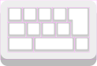
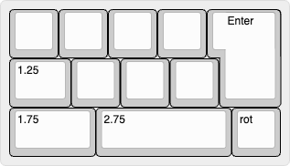

# Claudot

> *Each thought ends with a dot.*  
> *But it spins, unsure.*

[![CC BY-SA 4.0][cc-by-sa-shield]][cc-by-sa]

Claudot is an 11-key macropad with a rotary knob.

## Layout

Its name comes from the Japanese punctuation mark '。', known as **"句点"** (*ku-ten*, pronounced [koo-ten]), which means *period* or *full stop*.
The word **"句"** (*ku*) can refer to either a phrase or a clause.
Just as a sentence ends with a dot, this keyboard ends with a rotary encoder.

## License

This work is licensed under a
[Creative Commons Attribution-ShareAlike 4.0 International License][cc-by-sa].

[![CC BY-SA 4.0][cc-by-sa-image]][cc-by-sa]

[cc-by-sa]: https://creativecommons.org/licenses/by-sa/4.0/
[cc-by-sa-image]: https://licensebuttons.net/l/by-sa/4.0/88x31.png
[cc-by-sa-shield]: https://img.shields.io/badge/license-CC%20BY--SA%204.0-lightgrey.svg
