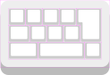
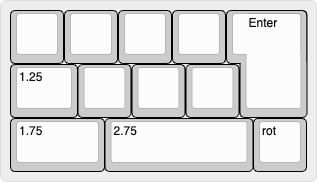
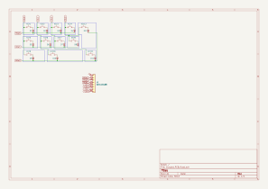
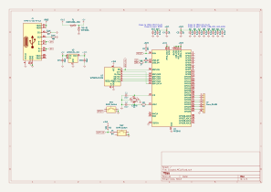

# Claudot

> *Each thought ends with a dot.*  
> *The dot is a key.*

[![CC BY-SA 4.0][cc-by-sa-shield]][cc-by-sa]

Claudot is an 12-key macropad.



## Layout



Named after the Japanese punctuation mark "。", known as **"句点"** (*ku-ten*, pronounced [koo-ten]) — the Japanese *period* or *full stop*.
The word **"句"** (*ku*) refers to either a phrase or a clause — a unit of meaning.

Just as a sentence ends with a dot,
a thought ends with a key.

## Schematic

This project was designed using KiCad.
All design files (schematic and PCB layout) are available in the `kicad/` directory.

Open the `.kicad_pro` file with KiCad to view or edit the project.




### FFC Connection

J1 (PCB) and J2 (MCU) are connected using a 0.5 mm pitch, 8-circuit FFC cable (e.g., MOLEX 15166 series compatible).

> [!CAUTION]
> The pin numbering is mirrored between J1 and J2 (1 ↔ 8, 2 ↔ 7, 3 ↔ 6, 4 ↔ 5).

### Key Matrix

This keyboard uses a 3-row by 4-column matrix (12 keys total).
Diodes are configured in the `COL2ROW` direction.

```
Column ──|>|── Switch ── Row
      (A)   (K)
```

### Pin Mapping

| Key Matrix | RP2040 |
|---|---|
| COL0 | GP18 |
| COL1 | GP19 |
| COL2 | GP20 |
| COL3 | GP21 |
| ROW0 | GP**23** |
| ROW1 | GP**22** |
| ROW2 | GP24 |

## License

This work is licensed under a
[Creative Commons Attribution-ShareAlike 4.0 International License][cc-by-sa].

[![CC BY-SA 4.0][cc-by-sa-image]][cc-by-sa]

[cc-by-sa]: https://creativecommons.org/licenses/by-sa/4.0/
[cc-by-sa-image]: https://licensebuttons.net/l/by-sa/4.0/88x31.png
[cc-by-sa-shield]: https://img.shields.io/badge/license-CC%20BY--SA%204.0-lightgrey.svg
